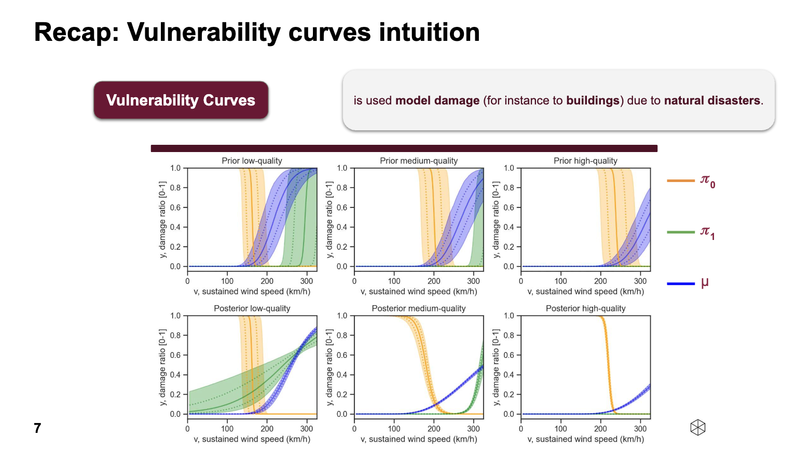
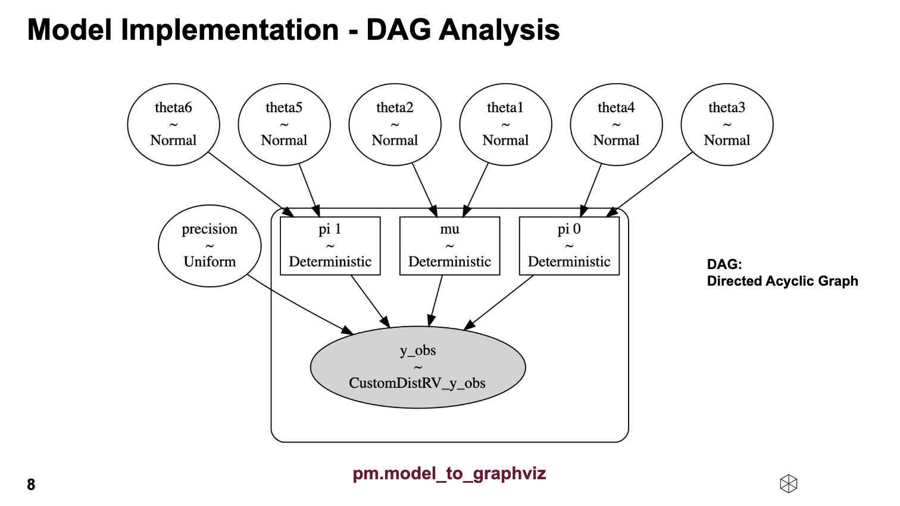
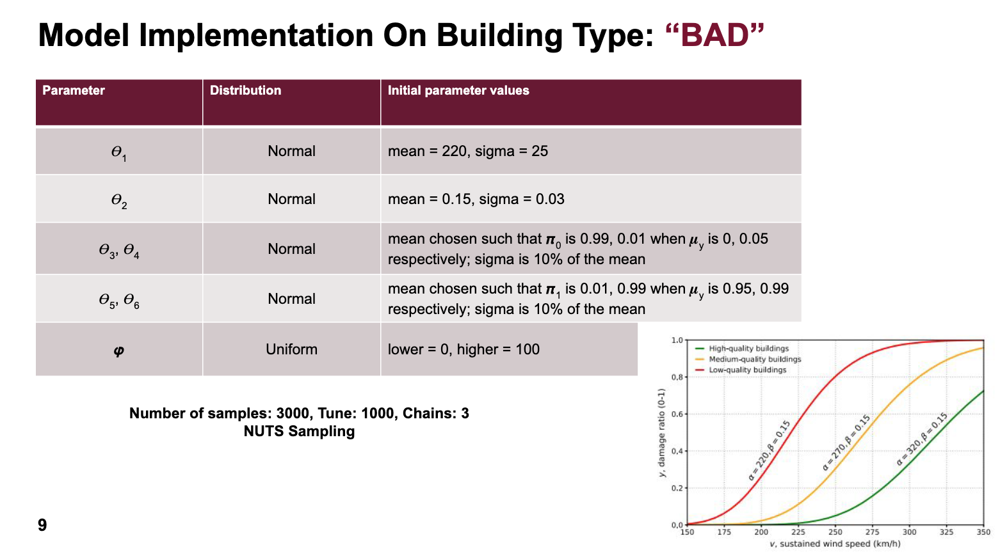
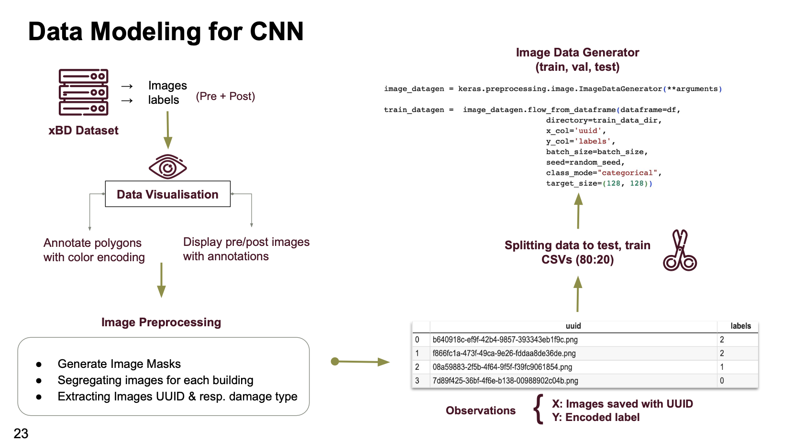
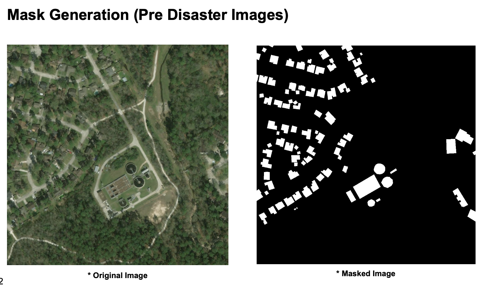
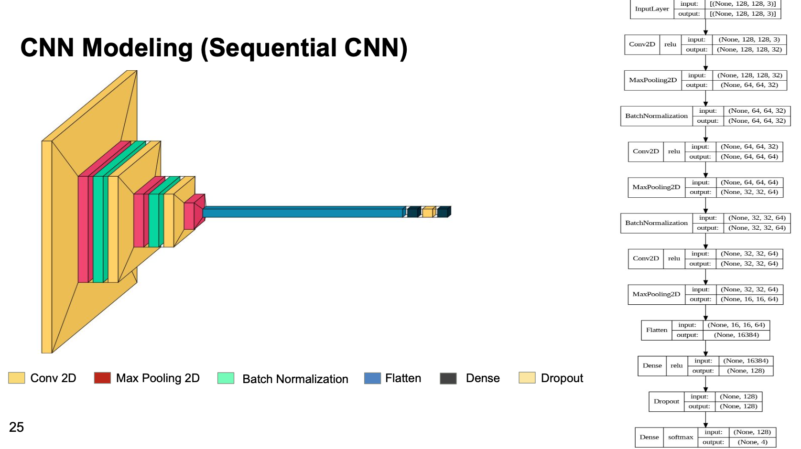

# Bayesian Updating of Hurricane Vulnerability Functions

A probabilistic modelling project implementing Bayesian updating of building vulnerability curves for hurricane damage assessment, with a CNN-based damage classification extension using satellite imagery.

**Course:** Probabilistic Modeling, Prof. Dr. Burkhardt Funk — Leuphana Universität Lüneburg  
**Group:** Genesis — Indraneel Dhulipala, Sanchit Bhavsar, Sthitadhee Panthadas  
**Presentation:** <a href="resources/Final Presentation prob modelling 2023.pdf" target="_blank">Final Presentation (2023)</a>

---

## Research Question

> "Is it possible to generate improved vulnerability curves from pre-existing knowledge about vulnerability curves (obtained through previous rapid impact assessments) with observed event-based impact data from social media?"

The goal is to update **vulnerability curves** — functions that map sustained wind speed to expected building damage ratio — using observed damage reports from Hurricane Dorian, sourced from social media (YouTube). Updated curves feed into **GRADE** (Global Rapid post-disaster damage Estimation).

---

## What Are Vulnerability Curves?

Vulnerability curves model damage to buildings caused by natural disasters. They plot damage ratio [0–1] against sustained wind speed (km/h) for different building quality categories (low, medium, high quality).



The three curves per plot are:
- **π₀ (orange):** Probability of zero damage
- **π₁ (green):** Probability of total loss given non-zero damage
- **μ (blue):** Mean damage ratio

Prior curves (top row) show wide uncertainty bands. Posterior curves (bottom row), updated with Hurricane Dorian observations, are significantly narrower — demonstrating the core value of the Bayesian approach.

---

## Model

### Zero-One Inflated Beta (ZOIB) Distribution

The likelihood function handles the three-part nature of damage data (no damage, partial damage, total loss):

```
f_ZOIB(y; π₀, π₁, μ, φ) =
  π₀                                          if y = 0
  (1 - π₀) · π₁                              if y = 1
  (1 - π₀)(1 - π₁) · f_beta(y; μ_y, φ)      if y ∈ (0, 1)
```

Link functions connecting wind speed `v` to damage probabilities:
- `μ_y = Φ(ln(v / θ₁) / θ₂)` — mean damage via cumulative log-normal
- `π₀ = logit⁻¹(θ₃ + θ₄ · v)` — probability of zero damage
- `π₁ = logit⁻¹(θ₅ + θ₆ · v)` — probability of total loss

### DAG (Directed Acyclic Graph)



The model has 7 stochastic parameters (θ₁–θ₆ ~ Normal, φ ~ Uniform) and 3 deterministic intermediate nodes (μ, π₀, π₁) feeding into the observed output `y_obs`.

### Prior Parameter Settings



Three building quality types — **BAD** (low), **MEDIUM**, **GOOD** (high) — each with distinct priors:

| Parameter | BAD (low) | MEDIUM | GOOD (high) |
|---|---|---|---|
| θ₁ (alpha) | 220 | 270 | 320 |
| θ₂ (beta) | 0.15 | 0.15 | 0.15 |
| φ (precision) | Uniform(0, 40) | Uniform(0, 40) | Uniform(0, 40) |

Sampler: **NUTS**, 3000 samples, tune=1000, 3 chains.

---

## Data

**Event:** Hurricane Dorian (Bahamas, 2019)

- Started with 498 YouTube videos → filtered to 15 relevant videos
- 3 experts analyzed **732 buildings** with known geolocations and assigned damage ratios
- Building type classification was performed per building

Wind field data: `max_wind_field.tif` (raster of peak sustained wind speeds)

---

## Key Findings

1. **Parameter recovery:** Estimated posterior means closely match true parameter values (e.g., θ₄ estimated at −164.82 vs. actual −164.16).
2. **Convergence fix:** Initial run showed a bimodal posterior for θ₁ (sampler converging to two solutions). Reducing φ's upper bound from 100 to 40 resolved this.
3. **Low autocorrelation:** Autocorrelation drops to near zero after lag 1, confirming efficient NUTS sampling.
4. **Discrepancy found:** The group's posterior plots matched the original authors' generated files, but those files did not match the published paper's plots. The original authors were notified.

---

## Contribution: CNN-Based Damage Classification

To automate the expert annotation step, the group built a CNN pipeline using the **xBD satellite imagery dataset** (covering Hurricanes Michael, Harvey, Matthew, and other disasters).

**4 damage classes:**
| Level | Label | Description |
|---|---|---|
| 0 | No Damage | No sign of structural, water, or shingle damage |
| 1 | Minor Damage | Roof elements missing, visible cracks, partial burning |
| 2 | Major Damage | Partial wall/roof collapse, surrounded by water/mud |
| 3 | Destroyed | Completely collapsed, scorched, or no longer present |

### Data Pipeline

Pre- and post-disaster satellite images from xBD are paired with JSON polygon annotations. The pipeline extracts individual building footprints, assigns damage labels, and prepares an 80/20 train/test split via CSV.



**Image preprocessing** generates binary masks from pre-disaster satellite images to isolate building footprints before feeding them into the CNN.



### Architectures

**Two architectures explored:**
- **ResNet50 (transfer learning):** Custom CNN branch (4096) + ResNet50 (8192) concatenated → Dense layers → 4-class softmax
- **Sequential CNN:** Conv2D × 3 + BatchNorm + Dropout → Dense → 4-class softmax (128×128 input)



**Result:** Sequential CNN achieved ~75.7% accuracy with minimal overfitting (train/val accuracy nearly identical over 30 epochs).

---

## File Structure

```
├── README.md
├── actual_model/               # Original authors' code + data
│   ├── estimate_posterior.R
│   ├── max_wind_field.tif
│   ├── observations_bad.csv
│   ├── observations_good.csv
│   ├── observations_medium.csv
│   └── parse_observations.py
├── archive/                    # Not in GitHub (large); train/test data for contribution
├── assets/
│   ├── data/
│   ├── posterior_parameters/   # Posteriors from original authors' code
│   ├── posterior_parameters_genesis/
│   ├── posteriors/
│   ├── posteriors_genesis/
│   ├── priors/
│   └── results/
├── resources/                  # Presentation images and PDF
│   ├── building-vulnerability-curves.png
│   ├── building-type-parameters.png
│   ├── dag-analysis.png
│   └── Final Presentation prob modelling 2023.pdf
├── src/
│   ├── 0_createSimulatedData.py
│   ├── 1_model.py
│   ├── 2_DrawPosterior_main.py
│   ├── 2_DrawPosterior_test.py
│   ├── 3_contribution.ipynb    # CNN contribution (main)
│   ├── 4_contribution_GPU.ipynb # GPU version of contribution
│   ├── 5_zoib_regression_bayesian.ipynb  # Colab version
│   ├── helper/
│   └── test.py
└── venv/                       # Not in GitHub
```

---

## Acknowledgement

This project reimplements and extends the model from:

> Jens A. de Bruijn et al. "Using rapid damage observations for Bayesian updating of hurricane vulnerability functions: A case study of Hurricane Dorian using social media." (2022). doi: [10.1016/j.ijdrr.2022.102839](https://doi.org/10.1016/j.ijdrr.2022.102839)
